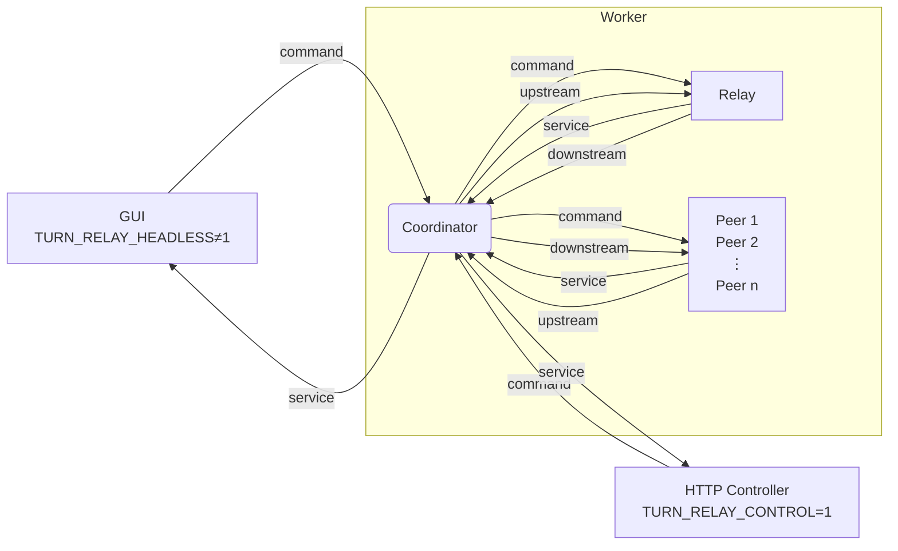

# Multi-peer, UDP Relay over TURN



This project relays UDP packets over a TURN server, to bypass NAT restrictions. Support for multiple peers allows reusing the TURN allocation for multiple peers.

## Getting started

Install Rust tool chain, then run:

```sh
cargo run
```

To build an executable, run:

```sh
cargo build --release
```

The built file should be under `target/release`.
